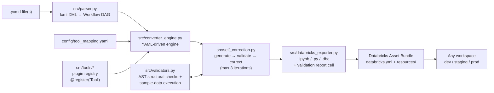

# 🧰 Altryx Accelerator — Alteryx → Databricks Converter (Skill Mode)

Convert Alteryx Designer workflows (`.yxmd`) into **validated, production-ready
PySpark notebooks** — driven by **one** Skill Mode notebook, packaged as a
**Databricks Asset Bundle**, and guarded by a **self-correcting validation loop**
that checks every generated notebook against the original Alteryx DAG.

[](https://github.com/aviral-bhardwaj/Altryx-Accelerator/actions/workflows/bundle-deploy.yml)


---

## Architecture



```
Altryx-Accelerator/
├── README.md
├── LICENSE                          # MIT
├── requirements.txt
├── pyproject.toml                   # pip-installable package
├── databricks.yml                   # ← Databricks Asset Bundle root
├── convert.py                       # CLI entry point
├── config/
│   ├── tool_mapping.yaml            # Alteryx tool → PySpark mapping (drives the engine)
│   └── source_tables.example.json   # input-table → Unity Catalog mapping example
├── src/                             # ALL heavy logic lives here
│   ├── parser.py                    # .yxmd XML (lxml) → Workflow DAG
│   ├── models.py                    # Workflow / Tool / Connection / Container
│   ├── converter_engine.py          # core YAML-driven conversion engine
│   ├── tools/                       # plugin-style tool registry
│   │   ├── base.py                  #   ToolConverter ABC + GeneratorContext
│   │   ├── registry.py              #   @register decorator + YAML overrides
│   │   └── builtin.py               #   35+ built-in tool converters
│   ├── expression_parser.py         # Alteryx formulas → PySpark expressions
│   ├── databricks_exporter.py       # .ipynb / .py / .dbc export + batch mode
│   ├── validators.py                # schema/row/aggregate + AST structural validation
│   ├── self_correction.py           # self-correcting validation loop
│   ├── job_validate.py              # migration job validation gate
│   ├── ai_generator.py              # optional Claude-assisted mode
│   └── context_builder.py           #   (prompt context for AI mode)
├── notebooks/
│   └── 01_Skill_Mode_Alteryx_to_Databricks.ipynb   # ← the ONLY notebook
├── resources/
│   └── alteryx_migration_job.yml    # multi-task batch migration workflow
├── marketplace/                     # Databricks Marketplace listing kit
│   ├── listing.yaml
│   └── PUBLISHING.md
├── tests/
│   ├── sample_workflows/            # 4 end-to-end .yxmd samples
│   └── test_*.py                    # 271 tests
└── .github/workflows/
    └── bundle-deploy.yml            # CI: pytest + bundle validate + deploy
```

---

## Quickstart on Databricks

1. **Get the code** — either:
   - **Git folder** (recommended): *Workspace → Create → Git folder* →
     `https://github.com/aviral-bhardwaj/Altryx-Accelerator`, or
   - **Bundle deploy** from your laptop:
     ```bash
     databricks bundle validate
     databricks bundle deploy -t dev
     ```
2. Open **`notebooks/01_Skill_Mode_Alteryx_to_Databricks.ipynb`** on a
   DBR 13.3+ cluster.
3. Set the widgets — `yxmd_path` (or `batch_mode` + `input_dir`),
   `target_catalog`, `target_schema` — and **Run All**.
4. Collect the converted notebooks (with their embedded validation reports)
   from the `output_dir`, or let the bundled **`alteryx_migration_job`** run
   the whole batch as a Databricks Workflow:
   ```bash
   databricks bundle run alteryx_migration_job -t dev
   ```

The notebook works out of the box against the bundled samples in
`tests/sample_workflows/` — no external data required.

### Quickstart locally

```bash
git clone https://github.com/aviral-bhardwaj/Altryx-Accelerator && cd Altryx-Accelerator
pip install -r requirements.txt

# single workflow, self-correcting, Jupyter + Databricks source output
python convert.py "my_workflow.yxmd" --self-correct --format ipynb,py

# whole folder in batch mode
python convert.py ./workflows --batch --self-correct --format ipynb
```

---

## The self-correcting validation loop

Every conversion runs through `src/self_correction.py`:

1. **Generate** — the engine converts the parsed DAG tool-by-tool
   (topological order, sequential `df_*` variables, `%md` docs, original tool
   names/configs preserved in comments).
2. **Validate** — the generated code is parsed with Python's `ast` module and
   compared against the `.yxmd` DAG:
   - every tool has its expected operation (`Join → .join()`,
     `Summarize → .groupBy().agg()`, …)
   - join keys and filter fields from the XML appear in the code
   - no unresolved DataFrame references, no syntax errors
   - optionally, the code is **executed against sample data** on your cluster
     and row counts/schemas are compared.
3. **Correct**
   - **FAILED** → regenerate in *strict mode*: each tool's raw
     `<Configuration>` XML is re-parsed granularly and unsupported tools get
     their full config inlined for manual follow-up.
   - **WARNING** → apply optimization rules without touching the logic:
     `F.broadcast()` on small inline inputs, Delta writes instead of CSV,
     `OPTIMIZE … ZORDER` guidance.
4. **Repeat** up to **3 iterations**. If still failing, the best attempt is
   exported with a detailed error report.

The full report (status, iterations, mismatches) is embedded as the **first
`%md` cell** of every exported notebook, and the migration job's
`validate_outputs` task fails the run if any workflow finished in FAIL state.

---

## Bundle deployment (dev / staging / prod)

`databricks.yml` defines three targets:

| Target | Mode | Root path |
|---|---|---|
| `dev` (default) | `development` | `~/.bundle/alteryx-to-databricks-converter/dev` |
| `staging` | `production` | `/Workspace/Shared/.bundle/...` (name-prefixed) |
| `prod` | `production` | `/Workspace/Shared/.bundle/...` + viewer permissions |

```bash
databricks auth login --host https://<your-workspace>   # once
databricks bundle validate                               # always before deploy
databricks bundle deploy -t dev                          # or staging / prod
databricks bundle run alteryx_migration_job -t dev
```

No hostnames are hardcoded — authentication comes from your CLI profile or
`DATABRICKS_HOST`/`DATABRICKS_TOKEN`. Override knobs at deploy time, e.g.
`--var="target_catalog=prod_catalog"`.

**CI/CD**: `.github/workflows/bundle-deploy.yml` runs the 271-test suite, an
end-to-end sample conversion, and `databricks bundle validate` on every push;
pushes to `main` (or manual dispatch) deploy the bundle. Set the
`DATABRICKS_HOST` and `DATABRICKS_TOKEN` repo secrets to enable it.

---

## Adding a new Alteryx tool mapping

No core changes needed — two options:

**Option A — Python plugin** (full control):

```python
# src/tools/my_tools.py
from src.tools import ToolConverter, register

@register("Tile")                      # the Alteryx plugin's short type name
class TileConverter(ToolConverter):
    def convert(self, tool, ctx):
        input_var = ctx.get_input_var(tool.tool_id)
        var = ctx.make_var_name(tool)
        ctx.set_output_var(tool.tool_id, var)
        return [f'{var} = {input_var}.withColumn("Tile_Num", F.ntile(10).over(...))']
```

**Option B — YAML only** (point at any importable class):

```yaml
# config/tool_mapping.yaml
tools:
  Tile:
    converter: src.tools.my_tools.TileConverter
    support: full
    spark_equivalent: ntile() window function
```

Then drop a sample `.yxmd` into `tests/sample_workflows/` and run `pytest` —
the structural validator picks up expectations from
`EXPECTED_OPERATIONS` in `src/validators.py` (add an entry for strict checks).

---

## Databricks Marketplace

This repo ships marketplace-ready: MIT license, versioned packaging,
listing metadata and a step-by-step publishing runbook in
[`marketplace/PUBLISHING.md`](marketplace/PUBLISHING.md). Short version:

1. Become a Marketplace provider (Provider Console entitlement).
2. Run the pre-submission checklist (`pytest`, `bundle validate`, clean-room
   notebook run).
3. Create a notebook/solution-accelerator listing and paste the copy from
   [`marketplace/listing.yaml`](marketplace/listing.yaml).

---

## Supported tools

35+ Alteryx tool types convert out of the box, including: Input/Output Data,
Text Input, Filter, Formula (full expression translation: `IF/ELSEIF`, `IIF`,
string/math/date/regex functions), Select, Join (J/L/R ports), Union,
Summarize, CrossTab, Transpose, Sort, Unique, Sample, Multi-Row Formula,
RegEx, RecordID, Append Fields and the In-DB (`LockIn*`) variants. The full
matrix with support levels lives in
[`config/tool_mapping.yaml`](config/tool_mapping.yaml). Unsupported tools never
break a conversion — they are passed through with a clearly flagged fallback
message and land in the validation report.

There is also an **optional AI mode** (`python convert.py … --mode ai`,
requires `ANTHROPIC_API_KEY`) that uses Claude for gnarly workflows the
deterministic engine flags as partial.

## Development

```bash
pip install -r requirements.txt
pytest tests/ -q          # 271 tests
python convert.py tests/sample_workflows --batch --self-correct --format ipynb,py
```

## License

MIT — see [LICENSE](LICENSE).
