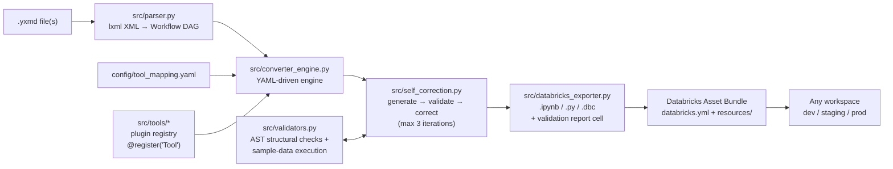

# 🧰 Altryx Accelerator — Alteryx → Databricks Converter (Skill Mode)

Convert Alteryx Designer workflows (`.yxmd`) into **validated, production-ready
PySpark notebooks** — driven by **one** Skill Mode notebook, packaged as a
**Databricks Asset Bundle**, and guarded by a **self-correcting validation loop**
that checks every generated notebook against the original Alteryx DAG **and can
execute it on sample data to verify row counts and schemas**.

[](https://github.com/aviral-bhardwaj/Altryx-Accelerator/actions/workflows/bundle-deploy.yml)


---

## Architecture



```
Altryx-Accelerator/
├── README.md
├── LICENSE                          # MIT
├── requirements.txt
├── pyproject.toml                   # pip-installable package
├── databricks.yml                   # ← Databricks Asset Bundle root
├── convert.py                       # CLI entry point
├── config/
│   ├── tool_mapping.yaml            # Alteryx tool → PySpark mapping (drives the engine)
│   └── source_tables.example.json   # input-table → Unity Catalog mapping example
├── src/                             # ALL heavy logic lives here
│   ├── parser.py                    # .yxmd XML (lxml) → Workflow DAG
│   ├── models.py                    # Workflow / Tool / Connection / Container
│   ├── converter_engine.py          # core YAML-driven conversion engine
│   ├── tools/                       # plugin-style tool registry
│   │   ├── base.py                  #   ToolConverter ABC + GeneratorContext
│   │   ├── registry.py              #   @register decorator + YAML overrides
│   │   └── builtin.py               #   35+ built-in tool converters
│   ├── expression_parser.py         # Alteryx formulas → PySpark expressions
│   ├── databricks_exporter.py       # .ipynb / .py / .dbc export + batch mode
│   ├── validators.py                # schema/row/aggregate + AST structural validation
│   ├── self_correction.py           # self-correcting validation loop
│   ├── job_validate.py              # migration job validation gate
│   ├── ai_generator.py              # optional Claude-assisted mode
│   └── context_builder.py           #   (prompt context for AI mode)
├── notebooks/
│   └── 01_Skill_Mode_Alteryx_to_Databricks.ipynb   # ← the ONLY notebook
├── resources/
│   └── alteryx_migration_job.yml    # multi-task batch migration workflow
├── marketplace/                     # Databricks Marketplace listing kit
│   ├── listing.yaml
│   └── PUBLISHING.md
├── tests/
│   ├── sample_workflows/            # 4 end-to-end .yxmd samples
│   └── test_*.py                    # 278 tests incl. Spark data-level e2e
└── .github/workflows/
    └── bundle-deploy.yml            # CI: pytest + bundle validate + deploy
```

---

## 📖 How to use — step by step

### Option A — On Databricks (recommended)

**Step 1 — Get the code into your workspace.** Either:

- **Git folder** (simplest): *Workspace → Create → Git folder* → paste
  `https://github.com/aviral-bhardwaj/Altryx-Accelerator` → Create; **or**
- **Bundle deploy** from your laptop (requires the
  [Databricks CLI](https://docs.databricks.com/dev-tools/cli/install.html) ≥ 0.218):
  ```bash
  git clone https://github.com/aviral-bhardwaj/Altryx-Accelerator
  cd Altryx-Accelerator
  databricks auth login --host https://<your-workspace-url>
  databricks bundle validate          # must pass before every deploy
  databricks bundle deploy -t dev
  ```

**Step 2 — Upload your `.yxmd` file(s).** Any of:
- *Workspace → your Git folder → Upload* (file lands next to the notebook),
- a Unity Catalog **Volume** (`/Volumes/<catalog>/<schema>/<volume>/my_flow.yxmd`),
- or skip uploading and **paste the workflow XML** directly into the notebook
  (Section 2, `PASTED_XML` variable — open your `.yxmd` in a text editor, copy all).

**Step 3 — Open the notebook** `notebooks/01_Skill_Mode_Alteryx_to_Databricks.ipynb`
and attach a cluster with **Databricks Runtime 13.3 LTS or newer**.

**Step 4 — Fill in the widgets** (top of the notebook after running cell 1–2):

| Widget | What it does | Default |
|---|---|---|
| `yxmd_path` | Path to a single `.yxmd` file | bundled sample |
| `batch_mode` | `true` = convert every `.yxmd` under `input_dir` | `false` |
| `input_dir` | Folder of `.yxmd` files for batch mode | `tests/sample_workflows` |
| `output_dir` | Where converted notebooks are written | `<repo>/output` |
| `output_format` | Any of `ipynb`, `py`, `dbc` (comma-separated) | `ipynb,py` |
| `target_catalog` / `target_schema` | Unity Catalog target for output tables | `main` / `alteryx_migrated` |
| `max_iterations` | Self-correction budget (1–3) | `3` |
| `run_sample_validation` | Execute generated code on this cluster and report rows/schemas | `false` |
| `debug_mode` | Print per-tool conversion status + schemas | `false` |
| `bundle_target` | Bundle target used by Section 8 commands | `dev` |

**Step 5 — Run All.** The notebook walks through 9 sections:
1. installs `lxml`, `pyyaml`, `nbformat` and wires up `src/`,
2. resolves your input (file / pasted XML / batch folder),
3. **shows the parsed workflow DAG** (tool table with connections) — check it
   matches what you see on the Alteryx canvas,
4. loads `config/tool_mapping.yaml` + your source-table mappings,
5. converts every tool in DAG order,
6. **runs the self-correction loop** and shows a per-iteration progress table,
7. exports `.ipynb`/`.py`/`.dbc` + `conversion_summary.json` to `output_dir`,
8. prints the exact `databricks bundle` commands to deploy,
9. (optional) executes the generated code on your cluster and prints
   row counts + schemas per DataFrame.

**Step 6 — Map your data sources (first real run).** Alteryx inputs that point
at local files (`C:\...\*.yxdb`, Excel, etc.) can't be read by Spark. The
generated notebook marks each one:

```python
# Tool 12: InputData — local Alteryx source, needs a Unity Catalog mapping
# TODO: map via source-tables config. Original source: C:/Users/.../Channel.yxdb
df_channel = spark.table("TODO.channel")
```

Create `config/source_tables.json` mapping tool IDs / annotations / path
substrings to real tables, then re-run:

```json
{
  "12": "main.bronze.channel",
  "transactions": "main.sales.transactions"
}
```

(CSV/Parquet paths and `catalog.schema.table` references convert automatically.)

**Step 7 — Open the converted notebook** from `output_dir`. The **first cell is
the validation report**: PASS/WARNING/FAIL, iterations used, and an itemized
list of anything needing review (unsupported tools, TODOs, optimizations
applied). Uncomment the `df.write.format("delta")...` line in the Output
section when you're ready to actually write tables — writes ship commented so
nothing touches your catalog until you say so.

**Step 8 (optional) — Run conversions as a scheduled Databricks Workflow:**

```bash
databricks bundle run alteryx_migration_job -t dev
```

This runs batch conversion + a validation gate that fails the job if any
workflow finished in FAIL state (`src/job_validate.py`).

### Option B — Local CLI

```bash
git clone https://github.com/aviral-bhardwaj/Altryx-Accelerator && cd Altryx-Accelerator
pip install -r requirements.txt

# 1) single workflow → self-corrected .ipynb + .py with embedded report
python convert.py "my_workflow.yxmd" --self-correct --format ipynb,py

# 2) whole folder, mirrored output structure + batch_summary.json
python convert.py ./workflows --batch --self-correct --format ipynb

# 3) inspect a workflow without converting
python convert.py "my_workflow.yxmd" --dry-run

# 4) map Alteryx inputs to Unity Catalog tables
python convert.py "my_workflow.yxmd" --self-correct \
    --source-tables-config config/source_tables.json

# 5) optional AI-assisted mode for gnarly workflows (needs ANTHROPIC_API_KEY)
python convert.py "my_workflow.yxmd" --mode ai
```

Then import the generated `.ipynb` into Databricks (*Workspace → Import*) or
commit it to a Git folder. To also **execute** the generated code locally,
`pip install pyspark` — the same validation the notebook runs in Section 9 is
available via `pytest tests/test_e2e_spark.py`.

### Option C — CI/CD (GitHub Actions)

1. In the repo: *Settings → Secrets and variables → Actions* → add
   `DATABRICKS_HOST` (e.g. `https://adb-123....azuredatabricks.net`) and
   `DATABRICKS_TOKEN`.
2. Every push/PR runs the 278-test suite, an end-to-end sample conversion, and
   `databricks bundle validate`. Without secrets, CI still passes using offline
   structural checks and prints a notice.
3. Pushes to `main` (or *Actions → Bundle Validate & Deploy → Run workflow*)
   deploy the bundle to the chosen target (`dev`/`staging`/`prod`).

---

## What "correct result" means — the self-correcting validation loop

Every conversion runs through `src/self_correction.py`:

1. **Generate** — the engine converts the parsed DAG tool-by-tool
   (topological order, sequential `df_*` variables, `%md` docs, original tool
   names/configs preserved in comments).
2. **Validate** — the generated code is parsed with Python's `ast` module and
   compared against the `.yxmd` DAG:
   - every tool has its expected operation (`Join → .join()`,
     `Summarize → .groupBy().agg()`, `Filter → .filter()`, …)
   - join keys and filter fields from the XML appear in the code
   - no unresolved DataFrame references, no syntax errors
   - with `run_sample_validation`, the code is **executed on your cluster**
     and per-DataFrame row counts + schemas are reported.
3. **Correct**
   - **FAILED** → regenerate in *strict mode*: each tool's raw
     `<Configuration>` XML is re-parsed granularly and unsupported tools get
     their full config inlined for manual follow-up.
   - **WARNING** → apply optimization rules without touching the logic:
     `F.broadcast()` on small inline inputs, Delta writes instead of CSV,
     `OPTIMIZE … ZORDER` guidance.
4. **Repeat** up to **3 iterations**. If still failing, the best attempt is
   exported with a detailed error report.

The report is embedded as the **first `%md` cell** of every exported notebook.

**Verified end-to-end**: the test suite doesn't just check structure — it
executes the generated notebooks on a real Spark session and asserts the
output **data values** match hand-computed Alteryx semantics (filter True/False
ports, join with key dedup, groupBy aggregations, `IF/ELSEIF/IIF` formulas,
`Trim`/`UPPERCASE` functions, type casts, unions). See
[`tests/test_e2e_spark.py`](tests/test_e2e_spark.py).

---

## Bundle deployment (dev / staging / prod)

`databricks.yml` defines three targets:

| Target | Mode | Root path |
|---|---|---|
| `dev` (default) | `development` | `~/.bundle/alteryx-to-databricks-converter/dev` |
| `staging` | `production` | `/Workspace/Shared/.bundle/...` (name-prefixed) |
| `prod` | `production` | `/Workspace/Shared/.bundle/...` + viewer permissions |

```bash
databricks auth login --host https://<your-workspace>   # once
databricks bundle validate                               # always before deploy
databricks bundle deploy -t dev                          # or staging / prod
databricks bundle run alteryx_migration_job -t dev
```

No hostnames are hardcoded — authentication comes from your CLI profile or
`DATABRICKS_HOST`/`DATABRICKS_TOKEN`. Override knobs at deploy time, e.g.
`--var="target_catalog=prod_catalog"`.

---

## Adding a new Alteryx tool mapping

No core changes needed — two options:

**Option A — Python plugin** (full control):

```python
# src/tools/my_tools.py
from src.tools import ToolConverter, register

@register("Tile")                      # the Alteryx plugin's short type name
class TileConverter(ToolConverter):
    def convert(self, tool, ctx):
        input_var = ctx.get_input_var(tool.tool_id)
        var = ctx.make_var_name(tool)
        ctx.set_output_var(tool.tool_id, var)
        return [f'{var} = {input_var}.withColumn("Tile_Num", F.ntile(10).over(...))']
```

**Option B — YAML only** (point at any importable class):

```yaml
# config/tool_mapping.yaml
tools:
  Tile:
    converter: src.tools.my_tools.TileConverter
    support: full
    spark_equivalent: ntile() window function
```

Then drop a sample `.yxmd` into `tests/sample_workflows/` and run `pytest` —
the structural validator picks up expectations from
`EXPECTED_OPERATIONS` in `src/validators.py` (add an entry for strict checks).

---

## Troubleshooting

| Symptom | Cause | Fix |
|---|---|---|
| `spark.table("TODO....")` in output | Alteryx input points at a local file (`.yxdb`, Windows path) | Map it in `config/source_tables.json` (Step 6 above) |
| Report says *UNSUPPORTED TOOL* | Tool has no registered converter | Data passes through unchanged; add a plugin (section above) or convert that step manually |
| Status `WARNING` with TODO items | Tool converted partially (e.g. TextToColumns delimiter) | Open the flagged cell — the original Alteryx config is in the comment |
| Status `FAIL` after 3 iterations | Structural mismatch the engine couldn't fix | The report's *Unresolved mismatches* section lists each issue with tool IDs |
| CI "Bundle validate" fails: `cannot configure default credentials` | `DATABRICKS_HOST`/`DATABRICKS_TOKEN` secrets not set | Add them in *Settings → Secrets* (CI passes with offline checks until then) |
| Output tables not created | Intentional: writes are commented out | Uncomment the `df.write...saveAsTable(...)` line after reviewing the notebook |

---

## Databricks Marketplace

This repo ships marketplace-ready: MIT license, versioned packaging,
listing metadata and a step-by-step publishing runbook in
[`marketplace/PUBLISHING.md`](marketplace/PUBLISHING.md). Short version:

1. Become a Marketplace provider (Provider Console entitlement).
2. Run the pre-submission checklist (`pytest`, `bundle validate`, clean-room
   notebook run).
3. Create a notebook/solution-accelerator listing and paste the copy from
   [`marketplace/listing.yaml`](marketplace/listing.yaml).

---

## Supported tools

35+ Alteryx tool types convert out of the box, including: Input/Output Data,
Text Input, Filter, Formula (full expression translation: `IF/ELSEIF`, `IIF`,
string/math/date/regex functions), Select, Join (J/L/R ports), Union,
Summarize, CrossTab, Transpose, Sort, Unique, Sample, Multi-Row Formula,
RegEx, RecordID, Append Fields and the In-DB (`LockIn*`) variants. The full
matrix with support levels lives in
[`config/tool_mapping.yaml`](config/tool_mapping.yaml). Unsupported tools never
break a conversion — they are passed through with a clearly flagged fallback
message and land in the validation report.

## Development

```bash
pip install -r requirements.txt
pytest tests/ -q                        # 273 tests (fast, no Spark needed)
pip install pyspark && pytest tests/ -q # 278 tests incl. data-level Spark e2e
python convert.py tests/sample_workflows --batch --self-correct --format ipynb,py
```

## License

MIT — see [LICENSE](LICENSE).
